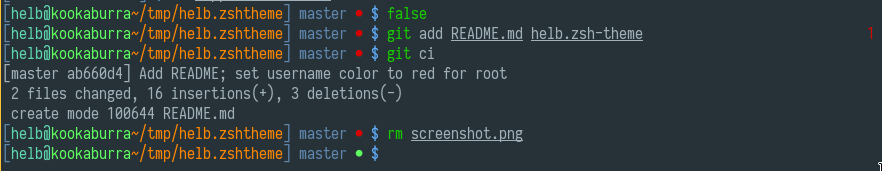

> ZSH prompt theme loosely based on old Gentoo's BASH theme.

## Features

- git info
- return value of last command
- different username color and prompt char for users (`$`) and root (`#`)

([kitty](https://github.com/kovidgoyal/kitty/) terminal emulator with [iosevka](https://be5invis.github.io/Iosevka/) font)
